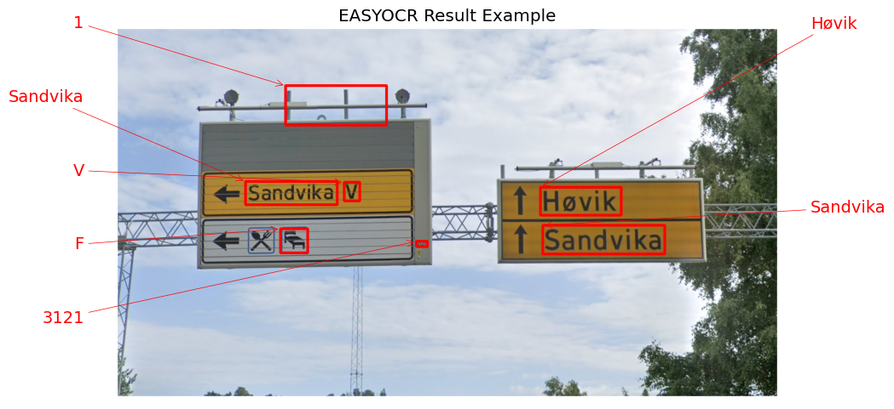
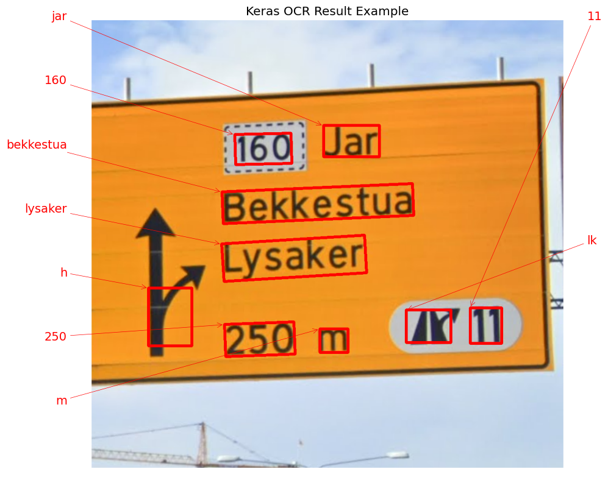

# Detect Text in Image

### *Extracting Text from Norway Traffic-Sign Images with comparison on easyocr and keras-ocr.*

> **Warning**
> The notebook (ipynb file) was executed on [kaggle](https://www.kaggle.com/code/marwanmusa/detect-text-in-traffic-sign-image), so you need to adjust your input path after you clone this repo.

*Documentation:*
- [EasyOCR](https://www.jaided.ai/easyocr/documentation/)
- [Keras-OCR](https://keras-ocr.readthedocs.io/en/latest/)

*Results of Extraction Sample:*

 
 

